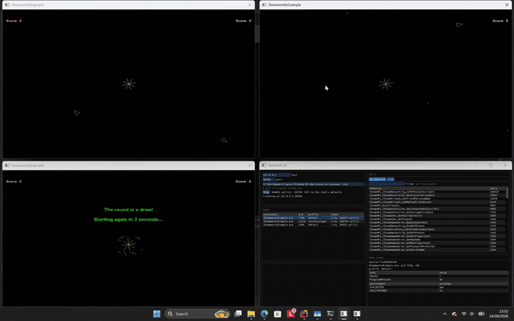

# SteamMock

Watch a real game's Steam calls arrive, live, without Steam.


*Two copies of one game running at once. The view lists each as its own session: the calls it makes, what answered
each one, how long it took, and the state that game is being told.*



*Three of them, and the view with them: one makes a lobby, the others join it, and all three are authenticated
against each other. [The full recording (30 MB, mp4)](https://github.com/TankNQX/SteamMock/releases/download/demo-two-instances/two-instances.mp4)
runs from the lobby menus through to the match, taken by the rig in `tools/` - including the part that does not work
yet, which its notes say out loud.*

## What you need

* **Windows**, with Visual Studio 2022 (or its Build Tools) and CMake.
* **Spacewar** - Valve's own test app, which Steam installs as app 480. It is in your Steam library
  as `Spacewar`, next to your other games.
* **A copy of this repository**, cloned with its submodules. If you cloned without them, run
  `git submodule update --init --recursive` inside your checkout.
* **Optionally, a Steamworks SDK** - yours, from Valve - if you want the stub to hand out interface
  objects. A game built against a recent SDK does not import the per-interface calls: it asks the
  stub for a version string and calls what it gets back. What the stub can answer that with is the
  imported layouts, and they are Valve's data, so they are not in this repository and the build
  works without them:

```bat
python -m venv .venv
.venv\Scripts\pip install -r tools\requirements.txt
.venv\Scripts\python tools\steamworks_sdk_import.py --sdk <sdk>\public\steam --out gen\steam_interfaces.json
```

  With none imported the stub answers every such request with null - the same thing a game sees from
  a steam_api that does not know the version - and `end_to_end` says so and skips those checks. The
  Spacewar walkthrough below is about the flat calls and the lobby, so it works either way.

## Step by step

**1. Build it.** From your checkout, 32-bit, because Spacewar's own program is 32-bit. This produces
the stand-in DLL and the window.

```bat
cmake -S . -B build -A Win32 -DSTEAMMOCK_BUILD_GUI=ON -DSTEAMMOCK_STUB_NAME=steam_api
cmake --build build --config Release
```

**2. Copy Spacewar somewhere of your own.** Copy the whole `Spacewar` folder out of your Steam
library - for example to `C:\dev\spacewar`. You work on the copy, so nothing about your installed
game changes.

**3. Put the built DLL in that copy.** Copy `build\Release\steam_api.dll` into your Spacewar copy,
next to `SteamworksExample.exe`. It takes the place of the real one.

**4. Start the window.** From your checkout:

```bat
build\Release\steammock_gui.exe --scenario scenarios\spacewar.json --start
```

The window opens already serving, and says `listening on 127.0.0.1:50990`.

**5. Start the game.** Run `SteamworksExample.exe` **from your copy** (not from Steam). Its own
window opens, and it talks to the window from step 4 instead of to Valve.

**6. Watch.** In the live view, a row appears for the game, with the profile `default` and the state
`live`, and the calls start scrolling past - its identity check, its controller, its stats, its
friends. Click around in the game's own window - Stats and Achievements, Friends - and those calls
appear as you do. The line above the list counts them: every call the game has made, and how many
were left to the game's own defaults.

**7. Stop when you are done.** Close the live view window, then close the game.

## What you are looking at

* **Games** - each running game, the profile it was matched to, and whether it is still connected. Two
  copies of one game can run at once: each gets its own session and its own row here.
* **Calls** - two views of the same calls, both narrowed by the filter box at the top. **by function**
  counts them, most-called first: a game that polls one call every frame buries everything else in a
  list, and this is the view that stays readable. **live** is the call-by-call list, where `via / ms`
  says where each answer came from - your scenario, the game's session state, or nobody - and how
  long it took.
* **Game state** - who the game thinks it is talking to: app id, Steam id, persona, language, and the
  stats and achievements it has been told about. Read-only for now.

Calls nobody answers are not a problem: they fall through to the values a game sees when Steam is not
running, which is why the game keeps going instead of getting an invented success.

## If nothing appears

* The game must be the one **from your copy**, with `steam_api.dll` beside it. Started from Steam, it
  never sees this project at all.
* The DLL must be the **32-bit** build from step 1. A 64-bit one will not load into Spacewar.
* The window must be **running first**. Started later, the game still finds it - the next call picks
  it up - and the row appears then.
* To see the other side of the conversation, run the game with `STEAMMOCK_LOG` set to a file
  (`set STEAMMOCK_LOG=stub.log` before `SteamworksExample.exe`) and read what the stub did.

## What this is not

* **Not for games you do not own.** It reports what a scenario tells it to report, and answers no
  ownership or entitlement question.
* **Not shippable.** A substitute `steam_api.dll` is a development tool. Keep it in your dev and test
  runs and out of anything you distribute.
* **Not a Steam emulator.** It never talks to Valve, so anything that needs the real service has to be
  scripted call by call.
* **Not Valve's code or data.** No Steamworks SDK, header, library or interface layout is in this
  repository, and nothing generated from them is committed either: the layouts are imported from an
  SDK you have, the files the generator writes are build outputs, and the two test apps are ours.

Contributors: `docs/development.md` has the source layout, the tests and what CI checks. Licensed
under MIT - see `LICENSE`.
