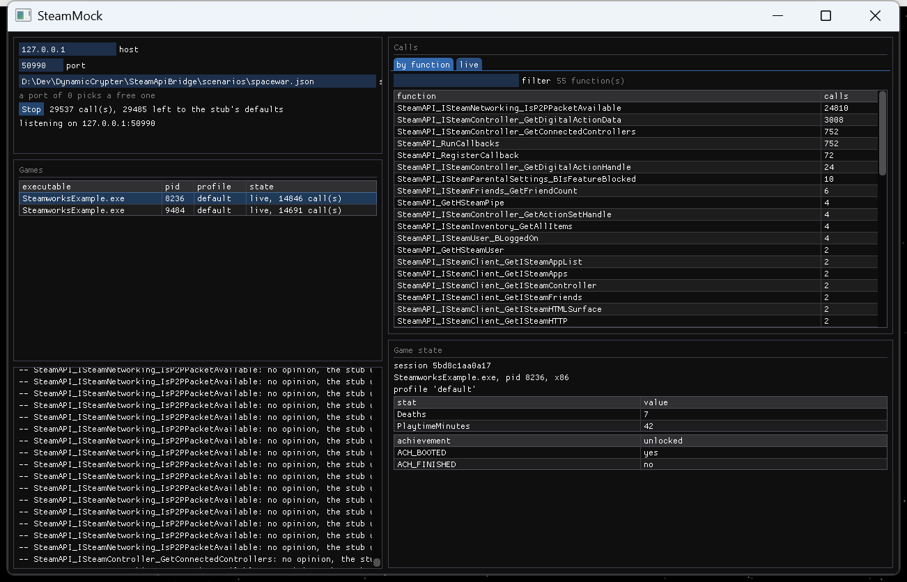

# SteamApiBridge

[](https://github.com/TankNQX/SteamApiBridge/actions/workflows/ci.yml)

**A Steam your game can talk to, without Steam.**

This stands in for `steam_api64.dll`. Your game loads it exactly like the real one, its Steam calls
are answered on your machine instead of Valve's, and a small JSON file decides what it hears: who
the player is, what their stats say, which achievements are unlocked.

The game needs no changes - same DLL name, same exported functions, no arguments, no code - so a
Steam integration can be worked on offline, in CI, or at 2am, and pointed at real Steam only once
the logic is settled.



*The live view: calls arriving, what answered each one, how long it took, and the state the game is
being told.*

## What you get

**Your game doesn't notice.** Drop the built `steam_api64.dll` beside the executable and it shadows
the real one. What it exports is generated from an IDL file, so the surface can cover whatever a
game imports.

**You decide what it's told.** A scenario matches a game to a profile - app id, Steam id, persona,
language, stats, achievements - and can script individual calls.

**Nothing is answered by accident.** A call the scenario has no opinion about falls through to the
game's own default, exactly as if Steam were not running. A game can never be handed a success
nobody asked for, and the transcript always says what happened and why.

**You can watch it happen.** The live view shows the calls as they arrive, and a game that has
exited stays visible with the state it was left with.

## Getting started

Needs Windows and an MSVC-style compiler - `cl.exe` or `clang-cl`.

```sh
# 1. Build. Produces build/Release/steam_api64.dll and build/Release/steambridge
cmake -S . -B build -A x64
cmake --build build --config Release

# 2. Start the backend. It prints the address it bound.
build/Release/steambridge --scenario scenarios/example.json

# 3. Run a game with the built DLL beside it, where it shadows the real steam_api64.dll.
#    Nothing else to configure - the game is not changed in any way.
```

To smoke test without a game of your own, the repo ships one:

```bat
set STEAMBRIDGE_STUB=build\Release\steam_api64.dll
build\Release\fake_game.exe
```

### What the stub reads from the environment

This is why a game needs no arguments:

| Variable | What it does |
| --- | --- |
| `STEAMBRIDGE_HOST`, `STEAMBRIDGE_PORT` | Where the backend is. Default `127.0.0.1:50990`. |
| `STEAMBRIDGE_OFF` | Set to `1` to bypass the bridge: every call answers as if Steam is absent. |
| `STEAMBRIDGE_TIMEOUT_MS` | How long a call waits for the backend. Default `2000`. |
| `STEAMBRIDGE_LOG` | A file to append the stub's own log to. |
| `STEAMBRIDGE_LOG_LEVEL` | `error`, `warning`, `info` (default) or `debug`. |

If no backend is listening, the stub says so once and every call takes its Steam-absent value. A
game still boots, and a backend started later is picked up on the next call.

### The backend's command line

| Option | What it does |
| --- | --- |
| `--host`, `--port` | Where to listen. `--port 0` picks a free one. |
| `--scenario FILE` | What each game is told (default `scenarios/example.json`). |
| `--transcript FILE` | Append every call, as JSON lines, to this file. |
| `--log-level LEVEL` | `error`, `warning`, `info` or `debug`. |
| `--list-api` | Print the calls the stub exports, then exit. |
| `--show-profiles` | Print the scenario's games and match rules, then exit. |

## Who answers a call, and why

Three rungs, first one that speaks wins. The transcript records which one it was:

1. **The scenario**, for the calls it scripts - `SteamAPI_Init` and friends, the policy calls where
   a scenario has to state its intent.
2. **The session's state** - identity, language, app id, stats and achievements, as the game
   changes them.
3. **Nobody.** The call is reported *unanswered*, and the stub returns what it would have returned
   with Steam absent.

That third rung is the point. A harness that guesses is worse than one that says "I don't know",
and a game that boots here boots anywhere.

## The live view

A window on the backend, for when a transcript is not enough:

```sh
cmake -S . -B build -A x64 -DSTEAMBRIDGE_BUILD_GUI=ON
cmake --build build --config Release
build/Release/steambridge_gui --scenario scenarios/example.json
```

It is **off by default**, because it is the only part of this project that needs other people's code
(the GLFW and Dear ImGui submodules). `--start` makes it serve straight away, which is also how it
can be driven from a script.

It reads snapshots of the server rather than driving it, so a slow frame cannot stall a game and the
window cannot invent an answer. What it does *not* do yet is change anything - editing stats,
unlocking an achievement or scripting a call from the window is the next step, and the "Game state"
panel is reserved for it.

## How the two halves fit together

```
   game.exe                        stub DLL (this repo)              backend (this repo)
   ────────                        ────────────────────              ───────────────────
   SteamAPI_Init()  ──import──▶   generated trampoline
   SteamAPI_ISteamUser_GetSteamID()      │
                                         │  4-byte length + JSON, 127.0.0.1:50990
                                         ▼
                                  BridgeClient ─────────────────▶  Server + Session
                                  (one connection per game)              │
                                         ▲                               │  scenario / state
                                         │        {"seq":7,"answer":"handled","ret":…,"out":{…}}
                                         └───────────────────────────────┘
```

Both halves are C++ in one CMake project and share one definition of the wire format, so the two
ends cannot drift apart. `docs/architecture.md` and `docs/protocol.md` have the details.

## Status

Working today: the loopback bridge, the backend and its session state machine, scenarios with
per-game profiles, out-parameters, the transcript, offline fallback, the API generator, and the live
view (read-only so far).

Worth doing next, roughly in order of value:

1. **Let the live view change things.** Edit a profile's stats and achievements while a game runs,
   and script a call on the spot - the "arbitrary logic" a scenario file cannot express.
2. **Callback injection.** Games expect `RunCallbacks` to deliver `UserStatsReceived`, and worse.
   The stub records registrations today; pushing an event needs the SDK's callback payload structs,
   and a reader thread in the stub.
3. **The whole export surface**, generated from your own `steam_api_flat.h`. The seed here is 41
   calls: the GameServer and `SteamInternal_*` helpers came out of the real headers, and the rest are
   hand-written and should be reconciled the same way before being relied on.
4. **Record and replay.** A pass-through mode that forwards to a real `steam_api64.dll`, records
   both directions, and replays the recording later. The `Transport` interface is already the seam.
5. **Struct and buffer parameters.** The type table covers scalars, strings and out-parameters;
   fixed-size structs and `char*` buffers need dedicated kinds.

## What this is not

* **Not a runtime for games you do not own.** It reports what a scenario tells it to report. Nothing
  here answers an ownership, entitlement or licensing question, and the defaults are the "Steam is
  not running" values.
* **Not shippable.** A substitute `steam_api64.dll` is a development tool; the Steamworks agreement
  does not allow redistributing one with a game. Keep it in your dev and test runs.
* **Not a Steam emulator.** It does not talk to Valve and stops at the API boundary: anything that
  needs the real service - matchmaking, friends, cloud - has to be scripted per call.

## Contributing

`docs/development.md` covers the source layout, what each test covers, what CI checks, and how to
add a call to the API surface.

## License

MIT. See `LICENSE`.
