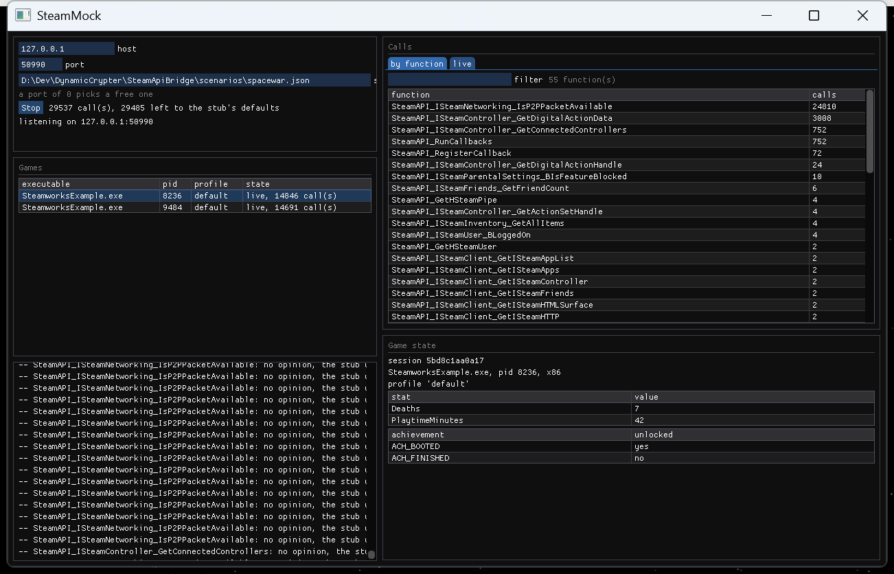
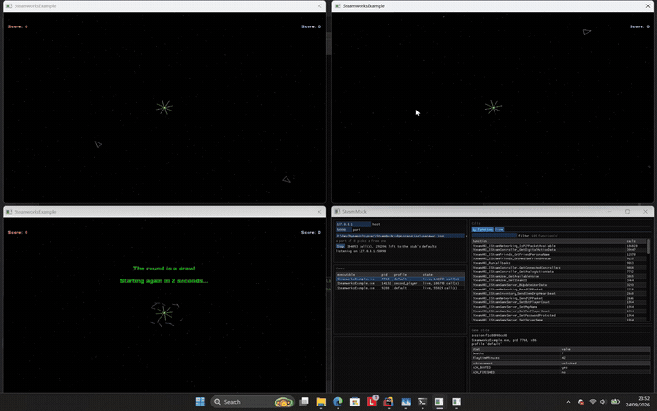

# SteamMock

[](https://github.com/TankNQX/SteamMock/actions/workflows/ci.yml) [](LICENSE)    

Watch a real game's Steam calls arrive, live, without Steam.



*Two copies of one game running at once. The view lists each as its own session, with the calls it
makes, what answered each one, how long it took, and the state that game is being told.*



*Three of them, and the view with them. One makes a lobby, the others join it, and all three are
authenticated against each other. [The full recording, 30 MB, mp4](https://github.com/TankNQX/SteamMock/releases/download/demo-two-instances/two-instances.mp4)
runs from the lobby menus through to the match, taken by the rig in `tools/`.*

Point a game at one DLL and every Steam call it makes lands in a window: the call, what answered it,
how long it took. No Steam client, no account, no Valve service, and no game code to change. Valve's
own test app runs against it through a lobby, a match, a leaderboard and its inventory screen.

## What it answers today

Every call reaches the backend. What differs is where the answer comes from:

* **Modelled**: a world answers it from state that outlives one session, such as a room or a board.
* **Session**: the per-game state machine answers it from the profile the game was matched to.
* **Stub**: the stub answers it itself and never asks the backend.
* **Scripted**: nothing is built in, and a scenario answers the calls that game makes.
* **Declined**: nobody has an opinion, so the game gets the value it would see with Steam absent.

The counts are from one run of the shipped Spacewar: two clients, one lobby, one match, a walk
through the leaderboard menu, and the stats screen.

| Interface | State | Answered by | Calls |
| --- | --- | --- | --- |
| `ISteamNetworking` | modelled | the lobby world: the P2P queues and sessions, one per end of a process | 446,134 |
| `ISteamController` | scripted | Spacewar's scenario, for six calls, and declined for the rest | 117,452 |
| `ISteamFriends` | modelled | the lobby world, and the roster it keeps names in after a player leaves | 41,204 |
| `ISteamGameServer` | modelled | the lobby world: logon, tickets, and the roster it broadcasts | 37,285 |
| `ISteamUser` | modelled | identity, and the auth tickets one peer is let in with | 21,793 |
| `ISteamInventory` | modelled | the item catalogue, and what one player holds | 5,874 |
| `ISteamUserStats` | modelled, session | the leaderboard world for the boards, the session for stats and achievements | 2,202 |
| `ISteamMatchmaking` | modelled | the lobby world: the rooms, their members, their data, and their chat | 120 |
| `ISteamClient` | stub | the stub itself, handing out one object per version string | 52 |
| `ISteamParentalSettings` | declined | nobody | 10 |
| `ISteamRemoteStorage` | declined | nobody | 4 |
| `ISteamHTMLSurface` | declined | nobody | 4 |
| `ISteamUGC` | declined | nobody | 2 |
| `ISteamUtils` | session | the session, with the overlay flag scripted | 2 |
| `ISteamApps` | session | the session: the app id, its language, its build id | never asked |
| `SteamAPI_*` top level | stub, scripted | the stub's own entry points, and the scenario's answers for `Init` and its neighbours | 17,196 |

A declined call is not a failure. The game gets the value it would see with Steam absent, so it keeps
going rather than being told something invented. A scenario can answer any call, including one listed
as declined, which is how Spacewar's controller and menus come up at all. Nothing here answers
ownership, entitlement or licensing. Seventeen more interfaces have nothing built in and the run never
asked for them, which [development.md](docs/development.md#the-calls-nobody-answers-yet) names. The
layouts this build imports carry 32 interfaces, and a game asking for a string they do not have gets
null, exactly what a Steam that does not know the string would give it.

## Run it

You need Windows, Visual Studio 2022 or its Build Tools, CMake, and Valve's own test app, which Steam
installs as app 480 in your library. Clone this repository with its submodules, and run
`git submodule update --init --recursive` if you cloned without them.

**1. Build the stub and the window.** 32-bit, because Spacewar's own program is 32-bit.

```bat
cmake -S . -B build -A Win32 -DSTEAMMOCK_BUILD_GUI=ON -DSTEAMMOCK_STUB_NAME=steam_api
cmake --build build --config Release
```

**2. Copy the game out of your library**, for example to `C:\dev\spacewar`, and put
`build\Release\steam_api.dll` into the copy, next to `SteamworksExample.exe`. You work on the copy,
so your installed game never changes.

**3. Start the window.** From your checkout:

```bat
build\Release\steammock_gui.exe --scenario scenarios\spacewar.json --start
```

It opens already serving and says `listening on 127.0.0.1:50990`.

**4. Start the game** from your copy, not from Steam.

**5. Watch.** A row appears for the game and the calls start scrolling past. Click around in the
game's own window, Stats and Achievements or Friends, and those calls appear as you make them.

If nothing appears, check three things. The game has to be the one from your copy, with
`steam_api.dll` beside it. The DLL has to be the 32-bit build from step 1. And the window has to be
running first, though a game started before it finds it on the next call. To see the other side of the
conversation, set `STEAMMOCK_LOG` to a file before starting the game and read what the stub did.

## The live view

* **Games.** Each running game, the profile it was matched to, and whether it is still connected. Two
  copies of one game run at once, each with its own session and its own row.
* **Calls.** The filter box narrows both views. **by function** counts the calls, most-called first,
  which stays readable when a game polls one call every frame. **live** is the call-by-call list,
  where `via` says where each answer came from and `ms` says how long it took.
* **Game state.** Who the game thinks it is talking to: app id, Steam id, persona, language, and the
  stats and achievements it has been told about.

## Where to read more

* Build it, test it, and what CI checks: [development.md](docs/development.md).
* How the two halves talk: [protocol.md](docs/protocol.md). How the whole thing is put together:
  [architecture.md](docs/architecture.md).
* Drive two copies of a real game, with the traps that cost runs: [two-instance-test.md](docs/two-instance-test.md).

## What this is not

* **Not for games you do not own.** It answers no ownership or entitlement question.
* **Not shippable.** A substitute `steam_api.dll` is a development tool. Keep it out of anything you
  distribute.
* **Not a Steam emulator.** It never talks to Valve, so anything that needs the real service is
  scripted call by call.
* **Not Valve's code or data.** No SDK, header, library or interface layout is in this repository, and
  nothing generated from them is committed.

Licensed under MIT, see `LICENSE`.
